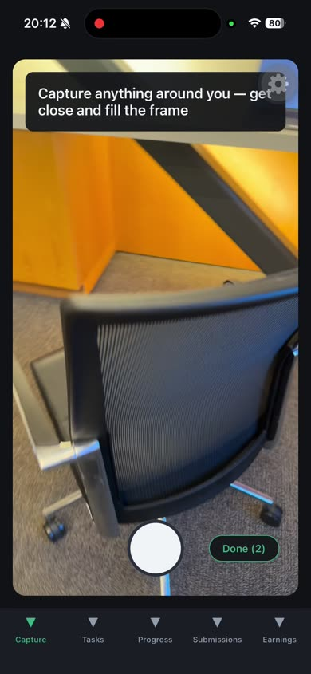
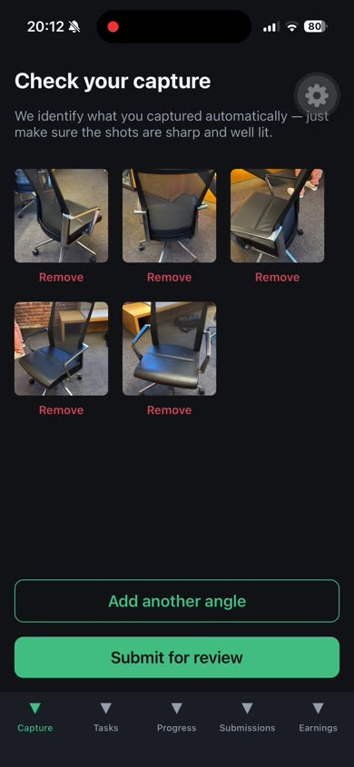
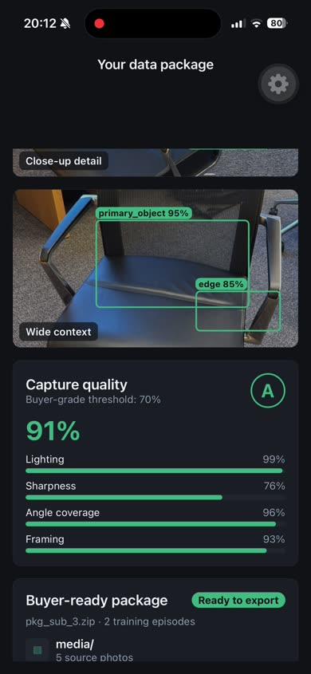
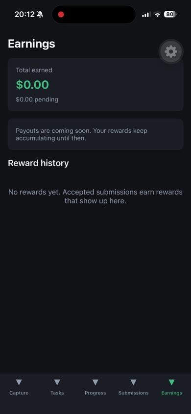

# OG Data

Turn idle moments into useful physical-world training data. Contributors capture everyday objects and environments with their phone; the app labels what they shot, packages it for buyers, and pays them when it passes review.

| Capture | Review | Data package | Earnings |
| :---: | :---: | :---: | :---: |
|  |  |  |  |

## How it works

1. **Capture** — Open the app and record a short walk-around clip of anything nearby (a bike rack, storefront, street sign, furniture). No task list required.
2. **Auto-label** — On submit, a vision model reads the video frame and location metadata, then assigns a category and short subject label. Contributors never type anything.
3. **Review** — An operator checks quality (angles, lighting, duplicates, supported subjects) and accepts, rejects, or asks for a retry with plain-language feedback.
4. **Earn** — Accepted captures accrue rewards. Totals and per-submission history live on the Earnings tab; payout rails are planned for a later release.
5. **Package** — After submit, the app previews a buyer-ready data package: original media, key frames, robot-vision labels, quality scores, and an export manifest.

Optional **Tasks** boost earnings when buyers need specific categories or locations. **Progress** adds streaks, levels, badges, and challenges so capture feels rewarding without turning into technical work.

## The problem

Robotics, physical AI, simulation, and spatial-mapping teams need large volumes of real-world object and environment data. Sending centralized field teams everywhere is slow and expensive. Millions of people already carry capable cameras and have idle windows — waiting at a bus stop, walking a neighborhood — but there is no simple, trusted way to capture useful data and get paid for it.

OG Data connects that demand with distributed contributors: easy on the phone, structured on the buyer side.

## Two sides of the product

| | Contributors | Data buyers |
| --- | --- | --- |
| **Who** | Everyday people with smartphones | Robotics / physical-AI companies, simulation teams, research ops |
| **Goal** | Capture something nearby, submit, see feedback, watch earnings grow | Get targeted, high-quality physical-world captures at scale without a field team |
| **Experience** | Camera-first, game-like, no jargon | Campaigns, quality signals, packaged datasets (operator-facing today) |

Contributor UX comes first. Buyer complexity stays behind operator tools until the capture loop is solid.

## Data labeling

Labeling is automatic at capture time, not a separate manual step for contributors.

- **Input:** One frame from the recorded clip plus GPS coordinates (when available).
- **Model:** OpenAI vision (`gpt-4o-mini` by default) classifies into buyer-meaningful buckets: `vehicle`, `furniture`, `storefront`, `signage`, `nature`, `infrastructure`, `indoor_object`, `other`.
- **Output:** A category and a short subject label (e.g. “red fire hydrant”) attached to the submission metadata.
- **Fallback:** If the API key is missing, the request times out, or parsing fails, the capture still submits as `uncategorized`. Reviewers always see the raw media.

This is MVP labeling — enough to sort captures and demo buyer value. Heavier annotation, 3D reconstruction, and production review automation are explicitly out of scope unless the [PRD](./README_PRD.md) changes.

## Earnings & rewards

| State | Meaning |
| --- | --- |
| **Pending review** | Submitted, waiting for operator decision |
| **Accepted** | Quality approved; reward assigned (amount can vary by task complexity and demand) |
| **Needs retry** | Fixable issue — retake with the feedback shown |
| **Rejected** | Does not meet guidelines |

The **Earnings** tab shows total earned, pending balance, and reward history per submission. Payout integration (cash-out, thresholds, compliance) is Post-MVP; rewards accumulate in the app until then.

Suggested **Tasks** display an expected reward range up front so contributors know what a campaign is worth before they start.

## Buyer-ready data packages

After submit, the **data package** screen shows what a buyer would receive — without claiming production-grade 3D reconstruction:

- Original capture (video or photos)
- Extracted key frames with detection-style overlays
- Capture prompt and context metadata (location, time, category, AI label)
- Quality report (coverage, clarity, consistency — scored and graded)
- Export manifest listing media + JSON sidecars

The builder is deterministic and client-side for the demo. It previews the *shape* of robotics-ready training data; final export formats stay flexible per buyer agreement (see Post-MVP **P3 — Dataset Packaging** in the PRD).

## App overview

| Tab | Purpose |
| --- | --- |
| **Capture** | Home screen — record and submit free captures |
| **Tasks** | Optional location-aware suggested tasks with reward ranges |
| **Progress** | Streaks, levels, badges, challenges, leaderboard |
| **Submissions** | History, status, reviewer feedback, retry entry |
| **Earnings** | Totals, pending rewards, payout-coming-soon notice |

Operator routes (not in the main tab bar): **Review queue**, **Campaigns**.

## Stack

Expo SDK 56 · React Native · TypeScript · expo-router · expo-camera · OpenAI vision (dev) · jest-expo

## Get started

```bash
npm install
npm start          # press i / a / w for iOS / Android / web
```

```bash
npm run typecheck
npm run lint
npm test
```

**AI labeling (optional, dev):** set `EXPO_PUBLIC_OPENAI_API_KEY` in `.env` or your shell so free captures get real categories instead of `uncategorized`. Submissions work without it.

**Note:** Video capture uses native camera APIs — use iOS or Android for the full capture flow; web shows a fallback message.

## Project structure

```
src/
  app/              # expo-router routes (thin — delegate to features)
  features/
    capture/        # Free capture + guided task capture flows
    submissions/    # History, status, retry
    review/         # Operator review queue
    rewards/        # Earnings screen
    data-package/   # Post-submit buyer package preview
    opportunities/  # Suggested tasks list
    progression/    # Streaks, levels, badges, challenges
    onboarding/     # First-run contributor intro
    campaigns/      # Operator campaign management
  shared/           # Types, API client, storage, UI tokens, AI helpers
  testing/          # Fixtures for tests and mock API
docs/
  screenshots/      # README app walkthrough (extracted from demo recording)
```

## Product source of truth

Scope, milestone status, and Post-MVP roadmap: [`README_PRD.md`](./README_PRD.md).
